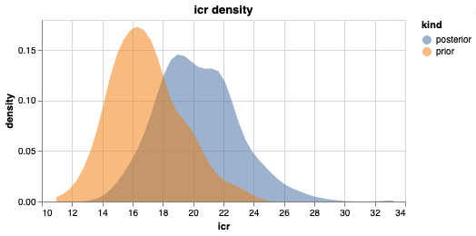
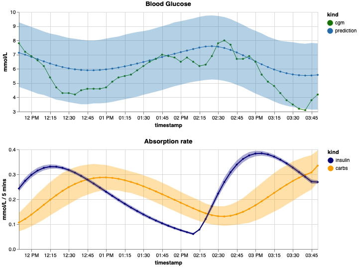
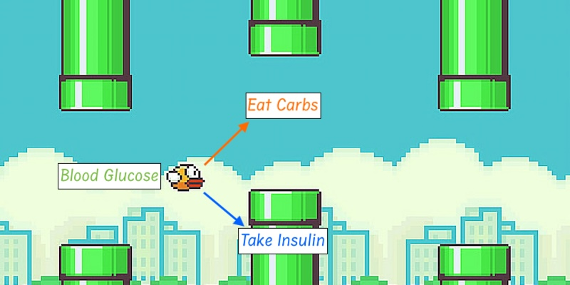
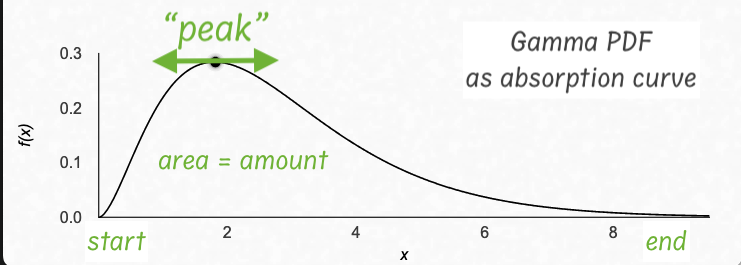

# Diamodel

[](https://colab.research.google.com/drive/1oh_RYEycgCcNHWL1tTdGOQMmYUCQD-Tu)

A Bayesian model to estimate key parameters for managing Type 1 Diabetes (T1D). The model takes CGM sensor readings, carbs, and insulin intake as input and estimates Insulin-to-Carbs Ratio (ICR), Correction Factor (CF), and Insulin Activity Time.





> [!IMPORTANT]
> **Disclaimer**: This project is for research and educational purposes only. It is not intended for clinical use and should not be used to make medical decisions.

## Why Diamodel

Managing T1D is like playing [Flappy Bird](https://flappybird.io/) nonstop in real life. Eating carbs raises blood sugar; taking insulin lowers it. The goal is to keep blood sugar within a target range (typically 4–10 mmol/L) so the body can function correctly. To "play" this lifelong game well, one needs to know how much carbs or insulin to take given the current glucose level (the bird's position) and all recent treatments (the bird's momentum). The challenge is that you don't know how the game physics works for each individual with T1D, i.e., the sensitivity of controls, and have to discover it by playing. But that's not all: the game physics changes over time, so one has to observe the changing dynamics and adapt accordingly.



This Flappy Bird example is just to illustrate the challenges of managing T1D, not to represent physiological processes in the human body. Obviously the human body and its internal processes are much more complex, yet we use a very simplified model to approximate blood glucose (BG) dynamics in response to carbs and insulin.

Specifically, the accepted model for diabetes management, i.e., what doctors teach T1D patients, assumes a linear relationship between carbs, insulin, and blood glucose and has the following parameters:

* **Insulin-to-Carbs Ratio (ICR)**, grams/unit — how many grams of carbs are covered by 1 unit of insulin.
* **Correction Factor (CF)**, mmol/L/unit — insulin sensitivity; how much blood glucose will be lowered in response to 1 unit of insulin.

These parameters are initially set by the diabetes doctor based on age and weight and periodically adjusted by reviewing daily and weekly glucose charts. The problem is that this is done subjectively and based on feel. For example, if the average blood sugar is higher than the target (usually 6.0 mmol/L), then more insulin should be given to bring levels down, which means ICR and/or CF should be adjusted. The question is, which parameter(s) should be adjusted and by how much? 🤷‍♀️ This is where the doctor simply makes a call based on experience and waits until the next checkpoint to see whether they hit the target, undershot, or overshot.


Even if the doctor were able to specify these parameters correctly, blood glucose might still be off because we need to provide accurate "effective" carb amounts which is another challenge. Not all eaten carbs will be absorbed; depending on other foods eaten, carbs will be absorbed differently; nutrition facts about carbs are only approximate values. These are just some of the reasons why carb counting is hard in the context of diabetes.

So in reality, everything around diabetes management has uncertainty. All parameters and inputs (blood glucose, carb amounts, and insulin units) have approximate values.

Diamodel tries to address these and other challenges by providing a data-driven way to estimate parameter distributions under uncertainty. Unlike more physiologically accurate models like UVA/Padova, Diamodel focuses on practical aspects of managing diabetes by using the same key parameters (ICR, CF) of the standard model. It tries to answer "what are the best ICR and CF values should we use given observed noisy data?".

## How It Works

Under the hood, Diamodel is a discrete-time probabilistic Bayesian model that models observed Continuous Glucose Monitor (CGM) data using the following equations:
```
CGM(t) = BG(t) + N(t)

dBG(t) = csens * CAR(t) - isens * IAR(t)

CAR(t) = sum([curve(t, start, amount + ccorri[i], cpeaki[i]) for i, start, amount in carbs])

IAR(t) = sum([curve(t, start, amount, ipeak) for start, amount in insulin])
```

* `CGM(t)` - observed CGM value, which represents noisy measurements of "true" (under Diamodel assumptions) BG levels.
* `N(t)` - autocorrelated CGM noise
* `dBG(t)` - change in "true" BG as the difference between total carbs and total insulin absorption. If carbs dominate, BG will rise, and if insulin dominates, BG will fall.
* `csens` - carbs sensitivity, mmol/L/gram; how much BG will rise per 1 gram of carbs.
* `isens` - insulin sensitivity, mmol/L/unit; how much BG will drop per 1 unit of insulin, a.k.a. Correction Factor (CF)
* `CAR(t)` - total carbs absorption rate as the sum of all stacked carbs, grams/tick
* `IAR(t)` - total insulin absorption rate as the sum of all stacked insulin, units/tick
* `cpeaki[i]` - i-th carbs curve peak parameter
* `ccorri[i]` - i-th carbs amount correction parameter
* `ipeak` - insulin curve peak parameter
* `curve(start, amount, t, peak)` - absorption response curve; represents the rate at which a given treatment (carbs or insulin) is absorbed over time.

Each treatment (carbs or insulin) is modelled with its own absorption curve. We use the [Gamma Distribution](https://en.wikipedia.org/wiki/Gamma_distribution) probability density function as the basis for absorption curves. The function has the convenient properties of integrating to 1 and having a single shape parameter, which we call "peak" because it roughly corresponds to the curve's peak location. The scale parameter of the Gamma PDF is always 1.



All insulin curves have the same shape (`ipeak`). Carbs curves have individual shapes (`cpeaki[i]`) so we can model "fast, medium, and slow" carbs absorption rates for each meal. In addition, carbs curves have individual amount corrections (`ccorri[i]`) to factor in uncertainty in carbs counting and allow the model to adjust carbs amounts to better fit observed data.

It's important to note that the simple formulation of Diamodel does not allow us to "fully" recover certain parameters from CGM observations alone, even if we had an infinite amount of data. This results in correlated parameter estimates where multiple combinations of parameters would produce the same likelihood. In the following equation, both `csens` and `isens` can be increased or decreased to achieve the same `dBG(t)` value:
```
dBG(t) = csens * CAR(t) - isens * IAR(t)
```

To address this non-identifiability issue, we first fit an insulin-only model on "insulin-only data" to estimate `isens`. Then we use it to set a tight prior for `isens` to guide the full model to pick a more realistic combination for `csens` and `isens`.

Diamodel does not model Hepatic Glucose Output (HGO, liver producing glucose) or Basal Insulin. Although the model can be extended to include these factors, we instead focus on selecting training intervals where these factors can be ignored in order to keep the model simple. For example, we assume that intervals right after meals have low HGO and as a result require low basal insulin coming from a pump. If basal insulin is given via injection, then a constant rate offset should be added to `IAR(t)`.

There are multiple options for how CGM noise can be modelled. The default model is an AR(1) process with autocorrelation coefficient `rho`. We assume that if CGM readings are off, they continue to be off for some time. The choice of CGM noise model will impact how Diamodel parameters are estimated. The `sigma` parameter represents total CGM noise.

## How To Use

[](https://colab.research.google.com/drive/1oh_RYEycgCcNHWL1tTdGOQMmYUCQD-Tu)


Diamodel takes CGM, carbs and insulin data as input. Carbs and insulin should be aligned to CGM ticks.

```
          timestamp  cgm  carbs  insulin
2025-10-23 11:34:00  6.4   12.0      0.6
2025-10-23 11:39:00  6.9    NaN      NaN
2025-10-23 11:44:00  7.2    NaN      NaN
2025-10-23 11:49:00  7.3    NaN      NaN
2025-10-23 11:54:00  7.6    NaN      NaN
...
```

Note that if data has missing treatments like carbs or insulin, it will cause bias in parameter estimation.

The model outputs a joint posterior probability of all parameters encapsulated in the `Fit` class. `Fit` can represent both prior and posterior probabilities of the parameters. `Fit.default()` specifies the default prior, which needs to be adjusted for each patient.

The `Config` class contains configuration for data and training. Some of the important fields are:

* `dt` - CGM readings interval, which specifies tick duration, minutes
* `maxact` - maximum curve duration, ticks
* `maxpred` - maximum prediction interval duration

There are two models: `InsulinModel` and `DiaModel`, which are the insulin-only and full model respectively. Both models have `select_chunks` methods that select subsets of data appropriate for fitting each model. Additionally, the Stan code contains hard-coded constants that need to be reviewed before fitting the model.

We assume the data has intervals where only insulin is acting, so we can fit the insulin-only model to get a good prior for `isens`. If there are no such intervals, then the `isens` prior should be set manually. See `Fit.default()` for how the prior can be set.

The models can be trained incrementally or using all data at once. The incremental mode is good to track changes in parameters over time, which can help answer questions such as "when does the honeymoon period end?"

`ICR` and `CF` can be recovered from the model using the following equations:

```
ICR = isens / csens
CF = isens
```

See [analyze.ipynb](./notebooks/analyze.ipynb) for how to fit the models and generate predictions.

## Development

The easiest way to run the code is to open the project in VSCode using Dev Container.

Inside running container:

```sh
# run tests
pytest .

# run notebooks
jupyter lab --ip 0.0.0.0 --port=8888 --allow-root --no-browser
```

To run a standalone container

```sh
# build the image
docker build -t diamodel .

# run dev container from the project root
docker run -it --rm --name=diamodel -p 8888:8888 -v $(pwd):/home/diamodel/diamodel diamodel /bin/bash
```
